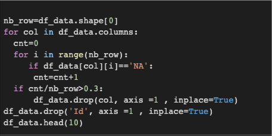
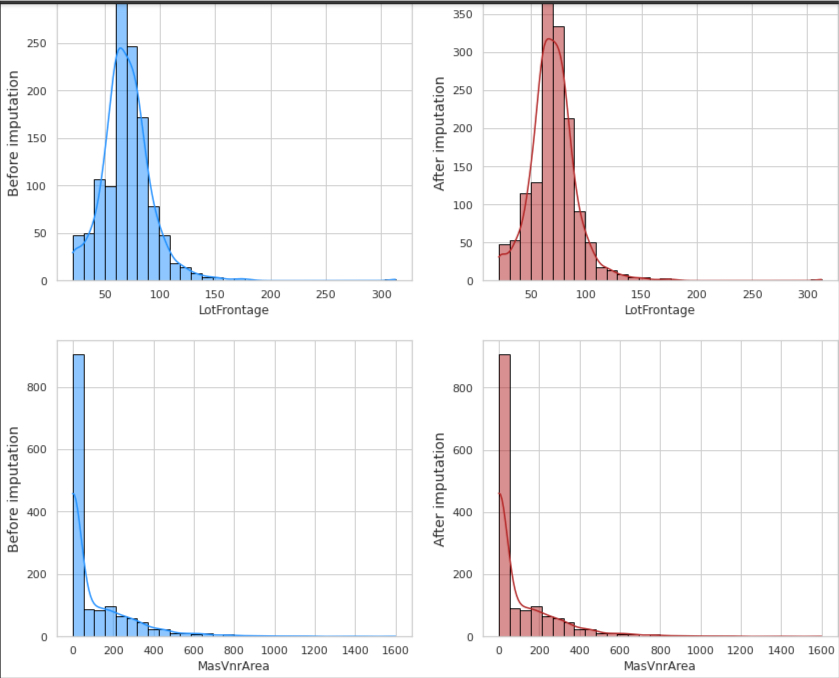
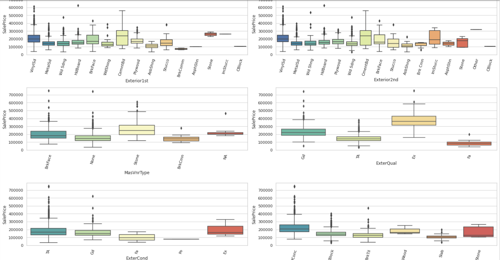
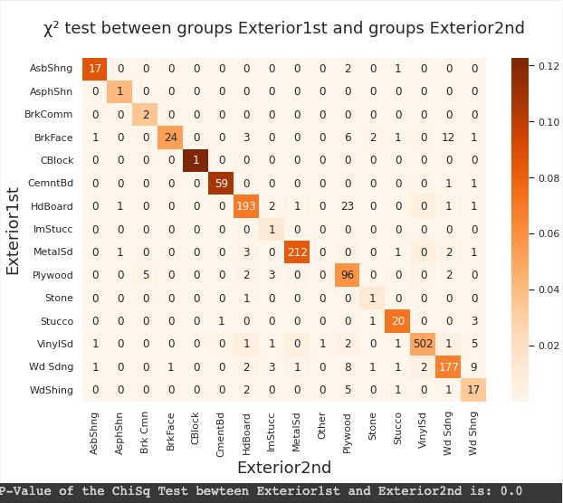
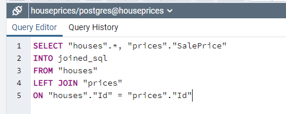
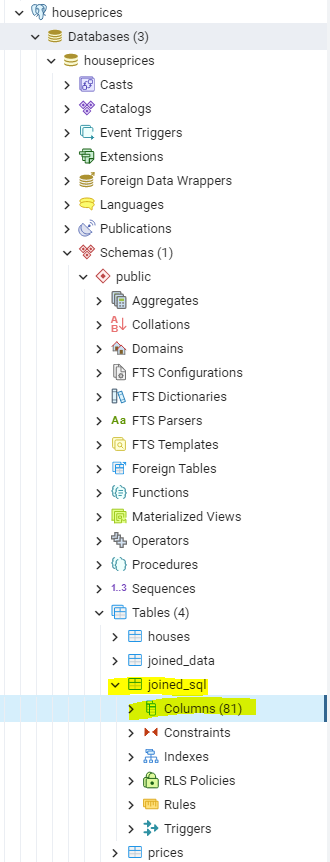
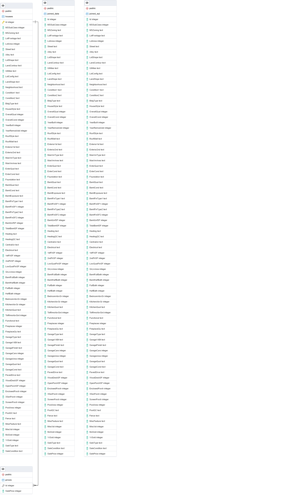
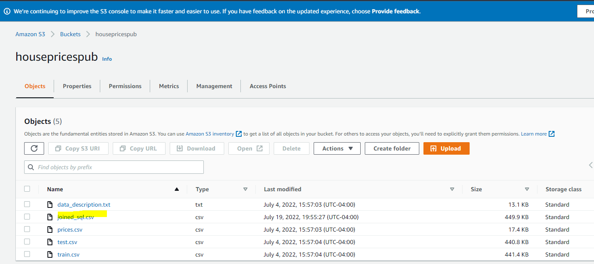

Team members: Elizabeth Ayisi, Lauren Tipple, and Dursun Caliskan

## Project Overview

### Visualization and Presentation - Liz

The team member in this role will be responsible for setting up the repository. This includes naming the repository and adding team members.
Once team members are all on board, it will be your responsibility to ensure everyone has his or her own branch to work from. 
You can create branches for them or they can create their own. Either way, 
it's important to separate your work and to keep the main branch free from code in progress. This memeber also created the Tableau Visualization to interact with the data.

#### Google Slide Presentation Link: [Google Slide Presentation](https://docs.google.com/presentation/d/1fbQLs9TsDw1QjUfXXw7MaDj-cBf5Nmi3FydxrKNgQAo/edit?usp=sharing)

### Machine Learning Model - Dursun

He is responsible for creating different machine learning models and comparing their accuracies.
Since the problem is prediction problem models will be supervised learning, linear regression models. They are
"Dummy Regressor", "Ridge", "Lasso", "DecisionTree", "AdaBoost", "Bagging", "GradientBoosting", "Random Forest" and "XGBoost Regressor"

### Database Creation - Lauren

You're using a SQL-based database, including an ERD of the database and a document pointing out how it is integrated into your database and 
how it works with the code. You'll need to use either sample data or even fabricated data to test it. When you submit this database for your
weekly grade, make sure you're submitting the data used for testing as well. Make sure to upload it to the repository along with the rest of the 
database-related work. 

### Selected Topic

We will be creating different models that predict the final price of homes in Ames, Iowa, and comparing their accuracies.

### Data
The data files provide categorical features about 1460 homes, most datatypes are string and integer. Number of rooms, square feet of rooms, dwelling, zoning, 
lot size, condition, and sale price are a few of the features.

### Database Storage

PostgreSQL was used for the database. We used Google Colab, pandas and pySpark to explore the data, extract, transform, and load into the database.
The database was created using AWS, RDS. 

### Systems

AWS, RDS, S3, PostgreSQL, spark, pyspark, google colab, pandas,numpy, seaborn,sklearn.impute, scipy, scipy.stats

**Files:**

Two csv files downloaded from Kaggle. The prices.csv was created in order to perform a join requirement for the project.

* [Resources/train.csv](Resources/train.csv)

* [Resources/test.csv](Resources/test.csv)

* [Resources/prices.csv](Resources/prices.csv)

### Summary

## Dursun completed the following tasks:

<<<<<<< HEAD
**1.** Got the access to data base that Lauren created, and extracted the data needed for the project. The following is a part of extracted dataframe. 

 

   
     
	* Created colab notebook, (refer to file House_Prices.ipynb), for machine learning model and used boto and psycopg2 to pull in the data from the PostgreSQL 		database.
	

=======
**1.** Got the access to data base that Lauren created, and extracted the data needed for the project. The following is a part of extracted dataframe.

   
     
* Created colab notebook, (refer to file House_Prices.ipynb), for machine learning model and used boto and psycopg2 to pull in the data from the PostgreSQL 		database.
	
>>>>>>> Dursun-MachineLearning
	
	* Turned the table data into dataframe

	    
  
**2.** Determined the column which have more than 30 % of missing data, and droped these columns. The following is the code to achieve this goal.

   

   In this step six columns are cleaned.
   

**3.** Decresed the number of numerical features by finding pairwise correlation coefficients.The matrix of correlation coefficiens is given in the   following figure:
   
   
<<<<<<< HEAD
    
We droped one feature from each pair which has corelation coefficients more than 0.8. Because, correlation coefficient is high so the correlation  between two features in the pair is strong, this means these features are strongly dependent, we can drop one of them.
    
=======
    
   We droped one feature from each pair which has corelation coefficients more than 0.8. Because, correlation coefficient is high so the correlation  between two features in the pair is strong, this means these features are strongly dependent, we can drop one of them. 
>>>>>>> Dursun-MachineLearning
   Four features are   droped in this step.
    
      
**4.** Filled the missing data by using KNNInputer with proving that it is the most relevant method, by using distribution graphs before and after as follows:

   

   We used also two of other method SimpleImputer(strategy=median) and SimpleImputer(strategy=most_frequent); we compare the distributiosns befoer and after inputation, obviously the KNNInputer gave the best result. So we decided to use it. One can see results in the code .
   
**5.** Decreased the number of categorical features by combination of box and whisker plots and Chi-Squre test, A part of Box and Whisker plot is given in the following figure:
    
   
     
   If we look at the figure carefully, some of the features have very similar disrtibutions shown by Box Plots. For example "Exterior1st" and   "Exterior2nd". This means they are potentially dependent. We check this by Chi-Squre test as follows:
   
   
    
<<<<<<< HEAD
 The contengincy table above and p-value belove the table show that features "Exterior1st" and   "Exterior2nd" are not independent (they are dependent, one can represent the other in the model). So we can drop one of them. In this method we droped three features.
=======
   The contengincy table above and p-value belove the table show that features "Exterior1st" and   "Exterior2nd" are not independent (they are dependent, one can represent the other in the model). So we can drop one of them. In this method we droped three features.
>>>>>>> Dursun-MachineLearning
  
    
**6.** Converted the categorical dataset to binary dataset by using dummies method shown below.

<<<<<<< HEAD
  
=======
   
>>>>>>> Dursun-MachineLearning

**7.** Merged the numerical and categorical dataset.

   
   
   At the end we cleaned the data succesfully to apply the m machine learning models. There are 154 features as seen in the final dataframe.
   
**8.** The Year of construction and the Year of Remodelling variables was transformed into new variables representing the      Age of the House and the Age since the house was remodelled.

The new variable are called as 'AgeSinceConst' and 'AgeSinceRemode; after that the columns 'YearBuilt' and 'YearRemodAdd' were droped by the code

> from datetime import date 
>
> todays_date = date.today()
>
> df_data_new["AgeSinceConst"] = todays_date.year - df_data_new["YearBuilt"]
>
> df_data_new.drop(["YearBuilt"], axis=1, inplace=True)
> 
**9.** Skewness of continuous feature were checked and log transformation was applied the sekew features by the following     code 

> continuous_features = ["OverallQual", "GrLivArea",
                       "FullBath", "GarageCars",
                       "MasVnrArea", "Fireplaces",
                        "AgeSinceConst", "AgeSinceRemod"]
> df_skew_verify = df_data_new.loc[:, continuous_features]
>
Select features with absolute Skew higher than 0.5

> skew_ft = []
>
> for i in continuous_features:
> 
>   skew_ft.append(abs(df_skew_verify[i].skew()))
>
> df_skewed = pd.DataFrame({"Columns": continuous_features,
                          "Abs_Skew": skew_ft})
>
> sk_features = df_skewed[df_skewed["Abs_Skew"] > 0.5]["Columns"].
> 
> for i in sk_features:
>   
>   df_data_new[i] = np.log((df_data_new[i])+1)

There are 5 skew features, they are 'GrLivArea', 'MasVnrArea', 'Fireplaces', 'AgeSinceConst'are 'AgeSinceRemod'.

**10.** Log transformation is also applied for the target variable 'SalePrice' to normalize it and the original 'SalePrice' column was droped by 

> df_data_new["SalePriceLog"] = np.log(df_data_new.SalePrice)
> 
> df_data_new.drop(["SalePrice"], axis=1, inplace=True)

You can see the distribution of 'SalePrice' before and after log transformation in the following picture:

The code to create the above picture is as folows

> from sklearn.preprocessing import FunctionTransformer
> 
> Y = df_data_new[["SalePrice"]]
> 
> logtransformer = FunctionTransformer(np.log, inverse_func = np.exp, check_inverse = True)
> 
> Y_log = logtransformer.transform(Y)
> 
> fig, axes = plt.subplots(nrows=1, ncols=2, sharex=False, sharey=False, figsize=(20,8))
> 
> sns.histplot(data=Y, x='SalePrice', stat="density", ax=axes[0],color='red')
> 
> axes[0].set_title("Before Log Transformation", color='black')
> 
> sns.histplot(data=Y_log, x='SalePrice', stat="density", ax=axes[1],color='green')
> 
> axes[1].set_title("After Log transformation", color='black')
> 
> plt.suptitle("Sale Price distribution before and after Log transformation",fontsize=22)
> 
> plt.show()

**11.** The features (X) and target (y) are extracted and they are splitted as train and test;
The codes are

> X = df_data_new[[i for i in list(
     df_data_new.columns) if i != "SalePriceLog"]]
>
>  y = df_data_new.loc[:, "SalePriceLog"]
>  
>  from sklearn.model_selection import train_test_split
>
> X_train, X_test, y_train, y_test = train_test_split(X, y, test_size=0.2,random_state=42)
>
> df_test_new=df_data_new
>
> df_test_new.drop(["SalePriceLog"], axis=1, inplace=True) 
   
   **Standardize the dataset**
   
> from sklearn import preprocessing
>
> std_scale = preprocessing.StandardScaler().fit(X_train)
> 
> X_train = std_scale.transform(X_train)
> 
> X_test = std_scale.transform(X_test)
>
> df_test_new = std_scale.transform(df_test_new)

**12.** Evaluation of the models

> !pip install xgboost
> 
> from sklearn.dummy import DummyRegressor
> 
> from sklearn.linear_model import Ridge, Lasso, LinearRegression
> 
> from sklearn.tree import DecisionTreeRegressor
> 
> from sklearn.ensemble import AdaBoostRegressor, BaggingRegressor, GradientBoostingRegressor, RandomForestRegressor
> 
> from xgboost import XGBRegressor
>
>
> dummy_reg = DummyRegressor(strategy="median")
> 
> ridge = Ridge(random_state=42)
> 
> lasso = Lasso(random_state=42)
> 
> dt_reg =  DecisionTreeRegressor(random_state=42)
> 
> adaboost = AdaBoostRegressor(random_state=42)
> 
> bagging = BaggingRegressor(random_state=42)
> 
> gdboost = GradientBoostingRegressor(random_state=42)
> 
> rdmforest = RandomForestRegressor(random_state=42)
> 
> xgbreg=XGBRegressor(random_state=42)

   **Creating accuracy matrix**
   
> model = [dummy_reg,ridge, lasso, dt_reg,adaboost, bagging, gdboost, rdmforest,xgbreg]
> dict_model = {}

> for model in model:
> 
>    model.fit(X_train, y_train)
>    
>    start_time = timeit.default_timer()
>    
>    y_pred = model.predict(X_test)
>    
>    mae = mean_absolute_error(y_test, y_pred)
>    
>    mse = mean_squared_error(y_test, y_pred)
>    
>    rmse = np.sqrt(mse)
>    
>    r_score = r2_score(y_test, y_pred, multioutput="variance_weighted").round(3)
>    
>    dict_model[model] = (mae.round(3), mse.round(3), rmse.round(3), r_score)
>    

> results = pd.DataFrame(dict_model, index=["MAE", "MSE", "RMSE", "r_score"])
> 
> results.columns = ["Dummy Regressor", "Ridge", "Lasso", "DecisionTree",
                      "AdaBoost", "Bagging", "GradientBoosting", "Random Forest","XGBoost Regressor"]
>
> results

  The accuracy matrix is 
  
  
  
Among these 9 methods the ones which have r_score (correlation coefficient) more than 0.85 are going to be accepted as accurate models. According to this assumption, methods 'Ridge', 'GradientBoosting', 'Bagging', 'Random Forest' and 'XGBoost Regressor' are acurate, given in descending order according to r_scores.

Although the methods 'DecisionTree' and 'AdaBoost' are not accurate according to our assumption, they are also good enough in accuracy.

The methods 'Dumme Regressor' and 'Lasso' worked in very low accuracy in predicting the house prices in our case.

<<<<<<< HEAD
=======
**8.** The Year of construction and the Year of Remodelling variables was transformed into new variables representing the      Age of the House and the Age since the house was remodelled.

The new variable are called as 'AgeSinceConst' and 'AgeSinceRemode; after that the columns 'YearBuilt' and 'YearRemodAdd' were droped by the code

> from datetime import date 
>
> todays_date = date.today()
>
> df_data_new["AgeSinceConst"] = todays_date.year - df_data_new["YearBuilt"]
>
> df_data_new.drop(["YearBuilt"], axis=1, inplace=True)
> 
**9.** Skewness of continuous feature were checked and log transformation was applied the sekew features by the following     code 

> continuous_features = ["OverallQual", "GrLivArea",
                       "FullBath", "GarageCars",
                       "MasVnrArea", "Fireplaces",
                        "AgeSinceConst", "AgeSinceRemod"]
> df_skew_verify = df_data_new.loc[:, continuous_features]
>
Select features with absolute Skew higher than 0.5

> skew_ft = []
>
> for i in continuous_features:
> 
>   skew_ft.append(abs(df_skew_verify[i].skew()))
>
> df_skewed = pd.DataFrame({"Columns": continuous_features,
                          "Abs_Skew": skew_ft})
>
> sk_features = df_skewed[df_skewed["Abs_Skew"] > 0.5]["Columns"].
> 
> for i in sk_features:
>   
>   df_data_new[i] = np.log((df_data_new[i])+1)

There are 5 skew features, they are 'GrLivArea', 'MasVnrArea', 'Fireplaces', 'AgeSinceConst'are 'AgeSinceRemod'.

**10.** Log transformation is also applied for the target variable 'SalePrice' to normalize it and the original 'SalePrice' column was droped by 

> df_data_new["SalePriceLog"] = np.log(df_data_new.SalePrice)
> 
> df_data_new.drop(["SalePrice"], axis=1, inplace=True)

You can see the distribution of 'SalePrice' before and after log transformation in the following picture:

The code to create the above picture is as folows

> from sklearn.preprocessing import FunctionTransformer
> 
> Y = df_data_new[["SalePrice"]]
> 
> logtransformer = FunctionTransformer(np.log, inverse_func = np.exp, check_inverse = True)
> 
> Y_log = logtransformer.transform(Y)
> 
> fig, axes = plt.subplots(nrows=1, ncols=2, sharex=False, sharey=False, figsize=(20,8))
> 
> sns.histplot(data=Y, x='SalePrice', stat="density", ax=axes[0],color='red')
> 
> axes[0].set_title("Before Log Transformation", color='black')
> 
> sns.histplot(data=Y_log, x='SalePrice', stat="density", ax=axes[1],color='green')
> 
> axes[1].set_title("After Log transformation", color='black')
> 
> plt.suptitle("Sale Price distribution before and after Log transformation",fontsize=22)
> 
> plt.show()

**11.** The features (X) and target (y) are extracted and they are splitted as train and test;
The codes are

> X = df_data_new[[i for i in list(
     df_data_new.columns) if i != "SalePriceLog"]]
>
>  y = df_data_new.loc[:, "SalePriceLog"]
>  
>  from sklearn.model_selection import train_test_split
>
> X_train, X_test, y_train, y_test = train_test_split(X, y, test_size=0.2,random_state=42)
>
> df_test_new=df_data_new
>
> df_test_new.drop(["SalePriceLog"], axis=1, inplace=True) 
   
   **Standardize the dataset**
   
> from sklearn import preprocessing
>
> std_scale = preprocessing.StandardScaler().fit(X_train)
> 
> X_train = std_scale.transform(X_train)
> 
> X_test = std_scale.transform(X_test)
>
> df_test_new = std_scale.transform(df_test_new)

**12.** Evaluation of the models

> !pip install xgboost
> 
> from sklearn.dummy import DummyRegressor
> 
> from sklearn.linear_model import Ridge, Lasso, LinearRegression
> 
> from sklearn.tree import DecisionTreeRegressor
> 
> from sklearn.ensemble import AdaBoostRegressor, BaggingRegressor, GradientBoostingRegressor, RandomForestRegressor
> 
> from xgboost import XGBRegressor
>
>
> dummy_reg = DummyRegressor(strategy="median")
> 
> ridge = Ridge(random_state=42)
> 
> lasso = Lasso(random_state=42)
> 
> dt_reg =  DecisionTreeRegressor(random_state=42)
> 
> adaboost = AdaBoostRegressor(random_state=42)
> 
> bagging = BaggingRegressor(random_state=42)
> 
> gdboost = GradientBoostingRegressor(random_state=42)
> 
> rdmforest = RandomForestRegressor(random_state=42)
> 
> xgbreg=XGBRegressor(random_state=42)

   **Creating accuracy matrix**
   
> model = [dummy_reg,ridge, lasso, dt_reg,adaboost, bagging, gdboost, rdmforest,xgbreg]
> dict_model = {}

> for model in model:
> 
>    model.fit(X_train, y_train)
>    
>    start_time = timeit.default_timer()
>    
>    y_pred = model.predict(X_test)
>    
>    mae = mean_absolute_error(y_test, y_pred)
>    
>    mse = mean_squared_error(y_test, y_pred)
>    
>    rmse = np.sqrt(mse)
>    
>    r_score = r2_score(y_test, y_pred, multioutput="variance_weighted").round(3)
>    
>    dict_model[model] = (mae.round(3), mse.round(3), rmse.round(3), r_score)
>    

> results = pd.DataFrame(dict_model, index=["MAE", "MSE", "RMSE", "r_score"])
> 
> results.columns = ["Dummy Regressor", "Ridge", "Lasso", "DecisionTree",
                      "AdaBoost", "Bagging", "GradientBoosting", "Random Forest","XGBoost Regressor"]
>
> results

  The accuracy matrix is 
  
  
  
Among these 9 methods the ones which have r_score (correlation coefficient) more than 0.85 are going to be accepted as accurate models. According to this assumption, methods 'Ridge', 'GradientBoosting', 'Bagging', 'Random Forest' and 'XGBoost Regressor' are acurate, given in descending order according to r_scores.

Although the methods 'DecisionTree' and 'AdaBoost' are not accurate according to our assumption, they are also good enough in accuracy.

The methods 'Dumme Regressor' and 'Lasso' worked in very low accuracy in predicting the house prices in our case.

>>>>>>> Dursun-MachineLearning
**13.** Creating dataframe which contains actual saleprices and predicted saleprices 

    **Predicted Sale prices by ridge model**
    
> from sklearn.model_selection import GridSearchCV
>
> alphas = np.logspace(-5, 5, 50).tolist()
>
> tuned_parameters = {"alpha": alphas}
>
> ridge_cv = GridSearchCV(Ridge(random_state=42), tuned_parameters, cv=5, n_jobs=-1, verbose=1)
>
> ridge_cv.fit(X_train, y_train)
>
> ridge_Reg = Ridge(alpha=ridge_cv.best_params_["alpha"])
>
> ridge_Reg.fit(X_train, y_train)
>
> y_pred = ridge_Reg.predict(X_test)
>
> y_pred_ridge = ridge_Reg.predict(df_test_new)
>
> saleprice_preds_ridge = np.exp(y_pred_ridge)
>
> df_salesprices_with_predictions = pd.DataFrame({"ActSalePrice": df_data['SalePrice'],"SalePriceRidge": saleprice_preds_ridge}) 
 
    **Predicted Sale Prices by Gradient Boosting Regressor**

> GradBoost_Reg=GradientBoostingRegressor(n_estimators=500,max_leaf_nodes=5)
>
> GradBoost_Reg.fit(X_train,y_train)
> 
> y_pred= GradBoost_Reg.predict(X_test)
>
> y_pred_GradBoost = GradBoost_Reg.predict(df_test_new)
>
> saleprice_preds_GradBoost = np.exp(y_pred_GradBoost)
>
> df_salesprices_with_predictions['SalePriceGradBoost']=saleprice_preds_GradBoost

     **Predicted Sale Prices by Bagging Regressor**
 
> from sklearn.ensemble import BaggingRegressor
>
> baggingR = BaggingRegressor()
> 
> baggingR.fit(X_train,y_train)
>
> y_pred= baggingR.predict(X_test)
>
> y_pred_Bagging = baggingR.predict(df_test_new)
>
> saleprice_preds_Bagging = np.exp(y_pred_Bagging)
>
> df_salesprices_with_predictions['SalePriceBagging']=saleprice_preds_Bagging

     **Predicted Sale Prices by Random Forest Regressor**
     
> from sklearn.ensemble import RandomForestRegressor
>
> RandForR =  RandomForestRegressor()
> 
> RandForR.fit(X_train,y_train)
> 
> y_pred= RandForR.predict(X_test)
>
> y_pred_RandFor = RandForR.predict(df_test_new)
>
> saleprice_preds_RandFor = np.exp(y_pred_RandFor)
>
> df_salesprices_with_predictions['SalePriceRandFor']=saleprice_preds_RandFor

    **Predicted Sale Prices by XgBoost Regressor**
    
> from xgboost import XGBRegressor 
>
> XgboostR =  XGBRegressor()
> 
> XgboostR.fit(X_train,y_train)
>
> y_pred= XgboostR.predict(X_test)
>
> y_pred_Xgboost = XgboostR.predict(df_test_new)
>
> saleprice_preds_Xgboost = np.exp(y_pred_Xgboost)
>
> df_salesprices_with_predictions['SalePriceXgboost']=saleprice_preds_Xgboost

 The result can be founnd in the csv file 
 
 A perspective of the resultant dataframe is given in the following picture:
 
 
 
<<<<<<< HEAD

 You can find the script in the following link: 
=======
  You can find the script in the following link: 
>>>>>>> Dursun-MachineLearning
  
  
## Liz completed the following tasks:
* Named and created a GitHub repository with a clear README_Seg1.md (This same README_Seg1 contains READ_Seg2)

* Created individual branches for group collaboration.

* Created a blueprint for the dashboard using Tableau with the train.csv and ML data sources.
*
* Created a Tableau Public Viz and can be accessed by clicking the following link https://public.tableau.com/app/profile/elizabeth8693/viz/PredictingHousePricesinIowa/Segment2_Dasboard

Dashboard_Segment_2 

## Lauren completed the following tasks:
  * Created PostgreSQL database through AWS RDS  

  
  * Created IAM roles for group collaboration.

  * Used pgAdmin to create the table schema in RDS.
	* House Data; 80 columns with Id as the primary key
	* Price Data; 2 columns with Id as foreign key
	* joined_data table: 81 columns, joining both data source files created in Colab file
	* joined_sql table: 81 columns, joined with SQL code in PGAdmin

  * Uploaded the CSV data files to S3. 
  

  * Used Spark on Colab to clean and transform the data (refer to ipynb file ).

  * Load the data from Pandas DataFrames into RDS.
  

  * Created ERD using pgadmin, however the clean joined_data table was created using Colab and Spark. 
  

  * Created new joined table using SQL code and updated the ERD that shows the connection of the keys.
  
 
  
 
  
 
 
   * Added joined_sql.csv file output to S3 bucket for Liz to use in data visualization. Tableau trail does not allow us to sync the database.
   
 
 
### Attribution

The dataset was sourced from [https://www.kaggle.com/competitions/house-prices-advanced-regression-techniques/data].
